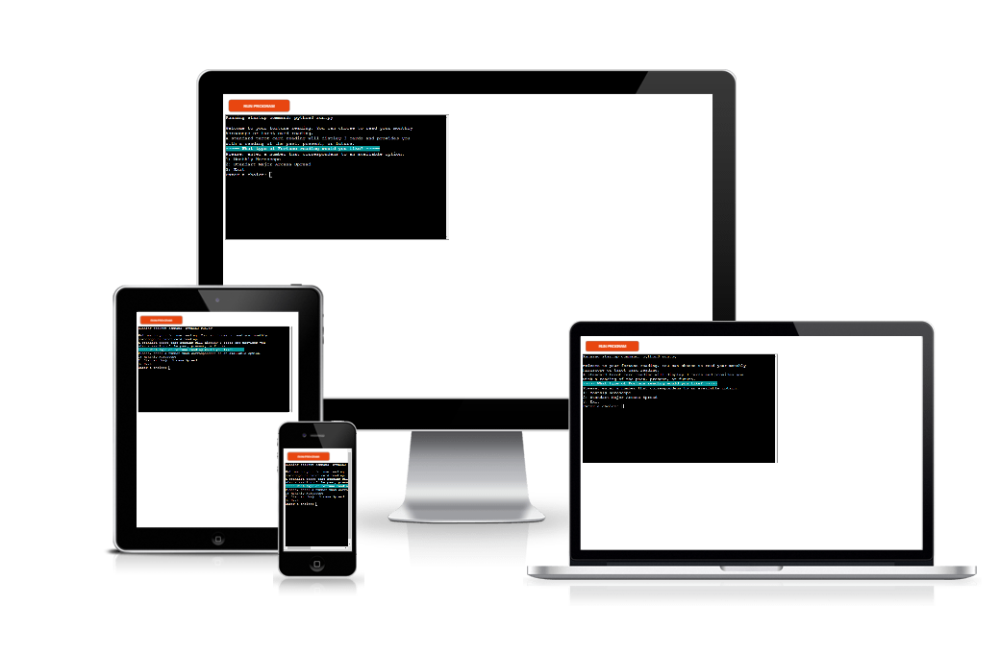

# Fortune Telling
Fortune Telling is a Python terminal game, which runs in the Code Institute mock on Heroku.

Users can read their fortune throug the Monthly Horoscope or from Tarot cards game.

# Content
* [Deployed page](https://fortune-telling.herokuapp.com/)
* [How to read fortune](#how-to-read-fortune)
* [Design](#design)
    - [Final Design](#final-design)
    - [Lucid Chart](#lucid-chart)
* [Features](#features)
* [Technologies](#technologies)
    - [Languages Used](#languages-used)
    - [Libraries](#libraries)
* [Bugs and Fix](#bugs)
* [Testing](#testing)
* [Deployment](#deployment)
* [Credits](#credits)
* [Acknowledgements](#acknowledgements)

## How to read fortune
Fortune telling program was created to provide users with an entertaining way to receive a monthly horoscope or tarot reading. For the horoscope reading, users can read monthly horoscope ( for Februar 2023). The horoscope is taken from [Russh](https://www.russh.com/february-horoscopes-2023/).

During my research I found that tarot reading can be performed in various ways using different card decks. For my program I am using the Major Arcana card deck which consist of twenty two cards. Each Major Arcana card will have two interpretations, one if the card is upright and another if the card is reverse. This program will reference a deck of twenty two cards that has forty four interpretations.

When a user runs the program they will receive a prompt. They must decide between a Monthly Horoscope reading and a Standard Major Arcana Spread reading. 
If the monthly horoscope is selected the user will be asked to enter the date of birth. After the correct date, the user will be asked by the program the month of birth. At the end, if  the month entered is valid than the horoscope will display for the specific sign.
If the data entry are not valid, an Error will display and the program starts from beginning.
If a standard tarot reading is selected the user will be shown a tarot card reading based on three random Major Arcana cards. The first card displayed represents the past, the second represents the present, and the third card represents the future. The program will display the three cards, if the cards are upright or reverse, and a description for each card. 

## Design
### Final Design
On the first section of the Fortune-telling program there are:
#### Greatings Part
#### Introduction to the program and the options it has
#### Input Area for the user's selection

### Lucid Chart
The flow chart was created using [Lucidchart](https://lucid.app/lucidchart/09ea5941-536f-457b-8b65-c086e605cb85/edit?page=0_0&invitationId=inv_ee3941cf-c670-4fa5-a6f6-242a0c8d8101#), a web-based diagramming application. The flow charts shown below, shows the design concept of Fortune-telling application.

## Features
After the Welcome and Introduction Section, an user input is required. 
User cannot read horoscope or tarot card without entering an option.

### First Option (Monthly Horoscope)
<ul>
<li>The selected option is 1 (Monthly Horoscope)
From the user is required to enter the date of birth.</li>

<li>If the date is valid, form the user is required to enter the month.</li>

<li>If the month is valid, the horosope for the specific sign will be shown.</li>

</ul>

### Second Option (Standart Major Arcana Spread)
<ul>
<li>The selected option is 2 (Standart Major Arcana Spread).
Three Tarot Cards will display randomly on the console. 
The first card deck is for the Past.
The second for the Present.
The third for the Future</li>

</ul>

### Third Option (Exit)
<ul>
<li>The selected option is 3 (Exit).
A goodbye message will appear.
</li>

</ul>

In order to run the program the random and pandas module must be imported. The main program ’run.py’ uses text and csv files. The main program also imports three classes OpeningMessage, PandasToList and EndingMessage.

The program also handles exception handling on user input. Exception handling will catch if a user inputs a non-integer. The exception will print a message telling the user to enter a valid input. If an input is an integer but not one of the options an if clause will catch it. The user will see a message with instruction on providing a valid input.

## Technologies
### Languages Used
- This program is created by using Python language.
    - Initial file provided by Code Institute. Unique code written by author.
- HTML

    - File provided in it's entirity by Code Institute.

- CSS

    - File provided in it's entirity by Code Institute.

- JavaScript

    - File provided in it's entirity by Code Institute.
### APIs
- [ANSI color codes in Python](https://pypi.org/project/ansicolors/) was used to cerate different colors for the messages of the program and heading separation.
   - [GitHub](hhttps://gist.github.com/rene-d/9e584a7dd2935d0f461904b9f2950007) repository for more information.

- [Git](https://git-scm.com/) - For version control
    These commands were used for version control during project:
    - git add . - To add files before committing
    - git commit -m "type your message mentioning changes" - To commit changes to the local repository
    - git push - To push all committed changes to the GitHub repository

- [GitHub](https://github.com/) - To create my repositories, save and store my project files.
- [pandas](https://pandas.pydata.org/) - Python Data Analysis Library
pandas is an open source data analysis and manipulation tool, built on top of the Python programming language. My codes are based on pandas code, as they contain extensive functions very well suited for parsing data.
- [random](https://www.w3schools.com/python/module_random.asp) - Random Module is used to generate random tarot cards.

## Bugs and Fix
One problem I faced is that the text printed from the horoscope in the terminal does not appear as expected.
Because of the long text information, the printed statement showed the error of many characters.
I used intendet to fix the issue, but again, in the terminal the text doesn't display properly as expected.
   - print("Speedster Mercury, your ruler, was embattled"
                          "last month in a retrograde, but now it’s moving"
                          "with intention through your Fun and Romance"
                          "zone until the middle of February. In addition"
                          "to hijinks, this part of the chart teals with"
                          "creativity, artistry, and fertility. In other"
                          "words, the birthing of ideas. You’re a"
                          "straightforward problem-solver by nature,"
                          "but sometimes answers and ideas to questions"
                          "can come from a sense of play, fun, ambiguity,"
                          "or the counterintuitive domains of the mind where"
                          "illogical elements hold sway. Pay due respect to"
                          "the Fun zone of your chart, and Mercury’s place in"
                          "it, by being a bit more loose in"
                          "the way you approach"
                          "your day, your routine, where you find inspiration."
                          "By the middle of February, things get more buttoned"
                          "up, with Mercury heading into your zone of Routine,"
                          "Diet, and Health."
                          "Most signs view this part of the chart"
                          "as a slog, but Virgo rules over the 6th"
                          "House of Routine."
                          "With Mercury transiting there, expect a bonanza"
                          "of appointments made and efficiently met."
                          "In other words, music to your Virgo ears.")
## Testing
   ### CI Python Linter
   I am using [CI Python Linter](https://pep8ci.herokuapp.com/) provide by Code Institute to validate the python code.
   - Because of using different classes, I have made different validations for each class.
   - OpeningMessage.py 
   - PandasToList.py 
   - run.py 
   - EndingMessage.py 
No errors were returned from PEP8online.com.

## Deployment
The Fortune-telling program was deployed using [Heroku](https://heroku.com/).
Following the "Love Sandwiches walkthrough project" for deployment:

1. Visit [Heroku.com](https://www.heroku.com/) and create a new account.
2. Click the 'New' button on the top right corner, and select 'Create new app' from the dropdown menu,
3. Create a name for your app using available App names in lower-case letters, numbers and dashes. This app was named "fortune-telling"
4. Select region, in this case, 'Europe'.
5. Click on the 'Create App' button.  
6. The app gets created in Heroku and Heroku dashboard gets opened.
7. Before any action, settings must be defined. Navigate to the settings tab and scroll down to the button 'Reveal Config vars'.
8. For the 'KEY', enter 'PORTS' in the input area and then for word 'VALUE', the value '8000' (as required by the steps for the assignment) then click on the 'Add' button.
9. Scroll down to 'Buildpacks'. Click the 'Add Buildpack' button.
10. From the pop up window, select 'python' and save changes.
11. Repeat this again but this time selecting 'node.js' and save the changes.
    It is 'important' to make sure the buildpacks are in the correct order with 'Python' first and 'node.js' second. If they are not in the correct order, drag them into the right order.
12. After the settings are done, navigate to the 'Deploy' tab at the top left side.
13. Select the option 'Github, 'connect to github' as the deployment method.
14. Search for the Github Repository in the search field (in this case 'fortune-telling') and start 'Search'.
15. When the search is complete the link to github repository will appear, click 'connect'.
16. Once the repository is connected to Heroku, Click the 'Enable Automatic Deploys' button for automatic deployment.
17. Alternatively one can manually deploy by selecting a branch to deploy from and clicking 'Deploy Branch'.
18. If 'Enable Automatic Deploys' is chosen, Heroku will build a new version of the app when a change to'gitpod' is pushed to 'Github'.  
19. Manual deployment allows the update the app whenever 'Deploy Branch' is clicked.
20. In case of this project, I selected 'Manual Deploy'.

21. Once the build process completes (this can take a few seconds), live app could be viewed by clicking button 'View' below 'Your app was successfully deployed'.
22. Link generated: https://fortune-telling.herokuapp.com/

## Credits

- A few references other than https://learn.codeinstitute.net/ci_program/diplomainfullstacksoftwarecommoncurriculum used for coding:
- Stack overflow
- https://www.w3schools.com/ 
- For installation of panda library: https://www.codegrepper.com/code-examples/shell/pandas+pip+install
- Break a long line into multiple lines in Python: https://www.geeksforgeeks.org/break-a-long-line-into-multiple-lines-in-python/

## ACKNOWLEDGEMENTS
I would like to acknowledge the following people who have helped me along the way in completing my third milestone project:

- My Mentor Jubril Akolade for his guidance, best suggestions and constant encouragement.
- My lovely husband for his patient and encouragement.